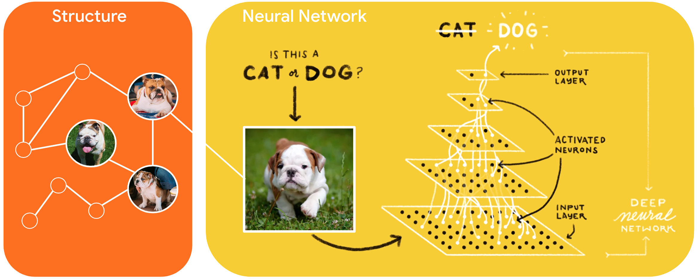

# Neural Structured Learning in TensorFlow



**Neural Structured Learning (NSL)** is a new learning paradigm to train neural
networks by leveraging structured signals in addition to feature inputs.
Structure can be explicit as represented by a graph [1,2,5] or implicit as
induced by adversarial perturbation [3,4].

Structured signals are commonly used to represent relations or similarity among
samples that may be labeled or unlabeled. Leveraging these signals during neural
network training harnesses both labeled and unlabeled data, which can improve
model accuracy, particularly when **the amount of labeled data is relatively
small**. Additionally, models trained with samples that are generated by
adversarial perturbation have been shown to be **robust against malicious
attacks**, which are designed to mislead a model's prediction or classification.

NSL generalizes to Neural Graph Learning [1] as well as to Adversarial Learning
[3]. The NSL framework in TensorFlow provides the following easy-to-use APIs and
tools for developers to train models with structured signals:

*   **Keras APIs** to enable training with graphs (explicit structure) and
    adversarial perturbations (implicit structure).

*   **TF ops and functions** to enable training with structure when using
    lower-level TensorFlow APIs

*   **Tools** to build graphs and construct graph inputs for training

The NSL framework is designed to be flexible and can be used to train any kind
of neural network. For example, feed-forward, convolution, and recurrent neural
networks can all be trained using the NSL framework. In addition to supervised
and semi-supervised learning (a low amount of supervision), NSL can in theory be
generalized to unsupervised learning. Incorporating structured signals is done
only during training, so the performance of the serving/inference workflow
remains unchanged. Please check out our tutorials for a practical introduction
to NSL.

## Getting started

You can install the prebuilt NSL pip package by running:

```bash
pip install neural-structured-learning
```

For more detailed instructions on how to install NSL as a package or to build it
from source in various environments, please see the
[installation guide](g3doc/install.md)

Note that NSL requires a TensorFlow version of 1.15 or higher. NSL also supports
TensorFlow 2.x with the exception of v2.1, which contains a bug that is
incompatible with NSL.

## Videos and Colab Tutorials

Get a jump-start on NSL by watching our video series on YouTube! It gives a
complete overview of the framework as well as discusses several aspects of
learning with structured signals.

<a href="http://www.youtube.com/watch?feature=player_embedded&v=N_IS3x5wFNI"
   target="_blank"></a>
<a href="http://www.youtube.com/watch?feature=player_embedded&v=pJRRdtJ-rPU"
   target="_blank"></a>
<a href="http://www.youtube.com/watch?feature=player_embedded&v=3RQqTTOY0U0"
   target="_blank"></a>
<a href="http://www.youtube.com/watch?feature=player_embedded&v=Js2WJkhdU7k"
   target="_blank"></a>

We've also created the following hands-on colab-based tutorials that will allow
you to interactively explore NSL:

*   [training with natural graphs](https://github.com/tensorflow/neural-structured-learning/blob/master/g3doc/tutorials/graph_keras_mlp_cora.ipynb)
*   [training with synthesized graphs](https://github.com/tensorflow/neural-structured-learning/blob/master/g3doc/tutorials/graph_keras_lstm_imdb.ipynb)
*   [adversarial learning](https://github.com/tensorflow/neural-structured-learning/blob/master/g3doc/tutorials/adversarial_keras_cnn_mnist.ipynb)

## Contributing to NSL

Contributions are welcome and highly appreciated - there are several ways to
contribute to TF Neural Structured Learning:

*   Case studies. If you are interested in applying NSL, consider wrapping up
    your usage as a tutorial, a new dataset, or an example model that others
    could use for experiments and/or development.

*   Product excellence. If you are interested in improving NSL's product
    excellence and developer experience, the best way is to clone this repo,
    make changes directly on the implementation in your local repo, and then
    send us pull request to integrate your changes.

*   New algorithms. If you are interested in developing new algorithms for NSL,
    the best way is to study the implementations of NSL libraries, and to think
    of extensions to the existing implementation (or alternative approaches). If
    you have a proposal for a new algorithm, we recommend starting by staging
    your project in the `research` directory and including a colab notebook to
    showcase the new features.

    If you develop new algorithms in your own repository, we are happy to
    feature pointers to academic publications and/or repositories that use NSL,
    on
    [tensorflow.org/neural_structured_learning](http://www.tensorflow.org/neural_structured_learning).

Please be sure to review the [contribution guidelines](CONTRIBUTING.md).

## Research

See our [research](research) directory for research projects in Neural
Structured Learning:

*   [A2N: Attending to Neighbors for Knowledge Graph Inference](research/a2n)
*   [GAM: Graph Agreement Models for Semi-Supervised Learning](research/gam)

## Issues, Questions, and Feedback

Please use
[GitHub issues](https://github.com/tensorflow/neural-structured-learning/issues)
to file issues, bugs, and feature requests. For questions, please direct them to
[Stack Overflow](https://stackoverflow.com) with the
["nsl"](https://stackoverflow.com/questions/tagged/nsl) tag. For feedback,
please fill this
[form](https://docs.google.com/forms/d/1AQEcPSgmwWBJj3H2haEytF4C_fr1aotWaHjCEXpPm2A);
we would love to hear from you.

## Release Notes

Please see the [release notes](RELEASE.md) for detailed version updates.

## References

[[1] T. Bui, S. Ravi and V. Ramavajjala. "Neural Graph Learning: Training Neural
Networks Using Graphs." WSDM 2018](https://research.google/pubs/pub46568.pdf)

[[2] T. Kipf and M. Welling. "Semi-supervised classification with graph
convolutional networks." ICLR 2017](https://arxiv.org/pdf/1609.02907.pdf)

[[3] I. Goodfellow, J. Shlens and C. Szegedy. "Explaining and harnessing
adversarial examples." ICLR 2015](https://arxiv.org/pdf/1412.6572.pdf)

[[4] T. Miyato, S. Maeda, M. Koyama and S. Ishii. "Virtual Adversarial Training:
a Regularization Method for Supervised and Semi-supervised Learning." ICLR
2016](https://arxiv.org/pdf/1704.03976.pdf)

[[5] D. Juan, C. Lu, Z. Li, F. Peng, A. Timofeev, Y. Chen, Y. Gao, T. Duerig, A.
Tomkins and S. Ravi "Graph-RISE: Graph-Regularized Image Semantic Embedding."
WSDM 2020](https://arxiv.org/abs/1902.10814)
